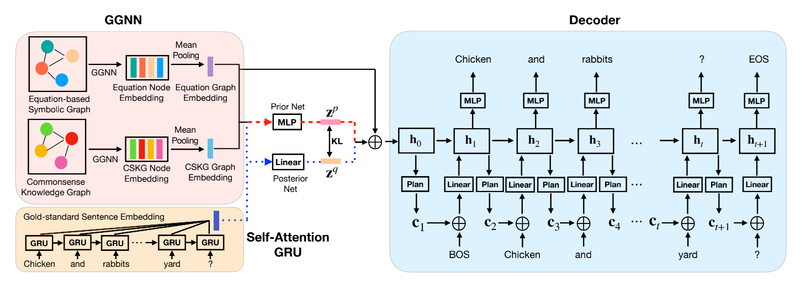
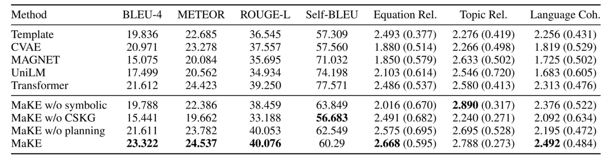

# MaKE

This repository is the implementation of  Mathematical Word Problem Generation from Commonsense Knowledge
Graph and Equations



<br>

## Dependencies
- Python >= 3.7<br>
- [Pytorch](https://pytorch.org) >= 1.5.0
- To develop locally, please follow th instruction below:

```shell
    git clone https://github.com/tal-ai/MaKE_EMNLP2021.git
    cd MaKE_EMNLP2021
    pip install -r requirements.txt
```

<br>

## Preprocess
- Please refer to the code: preprocess_data.py
- The original data: ./data  (you can read './data/Introduction_data.txt' to understand the data)
- Our preprocessing results: ./processed_data

<br>

## Train & Test
You can train the model as follow:
```
    python train_*.py
```

You can test the model as follow:
```
    python ./test/gen_*.py
```


<br>

## Results




<br>

## Contact
If you have any problem to the project, please feel free to report them as issues.
